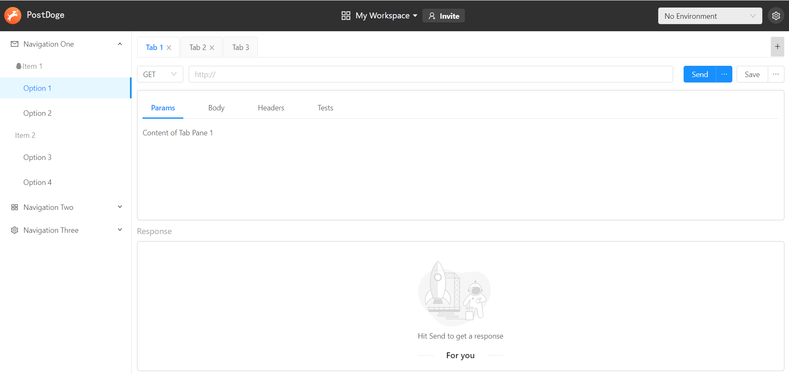

# PostDoge 🚀🐶 

> inspirationSource： Postman 、apizza、 Postwomen、 milkman


<p>
	
	
	
</p>



## Project setup
```
yarn install
```

### Compiles and hot-reloads for development
```
yarn run serve
```

### Compiles and minifies for production
```
yarn run build
```

### Run your tests
```
yarn run test
```

### Lints and fixes files
```
yarn run lint
```

### Customize configuration
See [Configuration Reference](https://cli.vuejs.org/config/).
